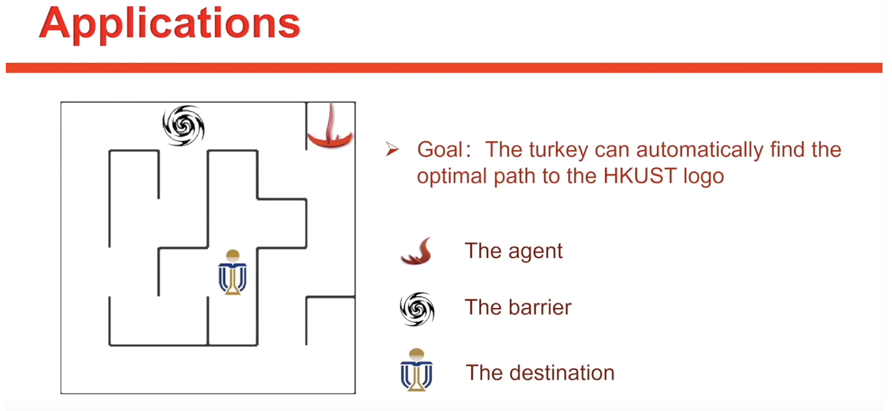

# Find Turkey

This is the project for the MSBD-5012 course. In this project, we will train an agent by the techniques of Reinforcement Learning (Q-Learning) to find the optimal path to the HKUST Logo in the maze. 

For further demonstration, please refer to the Youtube Link: [HKUSTurkey](https://www.youtube.com/watch?v=fMvjmkVorFg)

The following picture shows the overview of this project:


# Team Member

| Name | SID |
| --- | --- |
| ZHENG Dongjia | 20546139 |
| XIE Zhongkai | 20550477 |
| WANG Yutong | 20541402 |
| KUANG Bingran | 20565874 |
| GAO Yang |20550946  |

# Initialization
1. Firstly, use the file `envirnment.yml` to set up a conda environment called `hkust-env`. To be more detail, you can go to the directory and execute the following command in your terminal.
```
conda env create -f environment.yml
```

2. Secondly, after the installation, execute the command line `source activate hkust-env`（Mac/Linux）or `activate hkust-env`（Windows）to activate the environment so that you can run the source code.